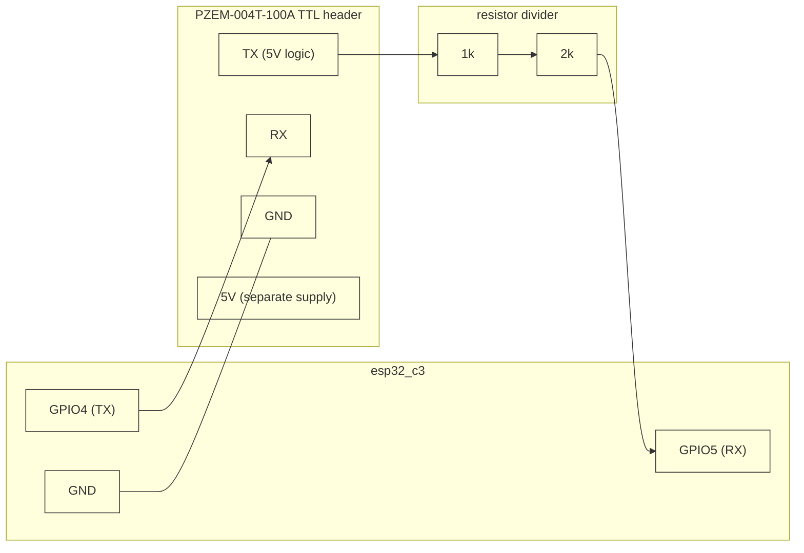

# DLR Line Loading Sim ⚡🔄


> ESP32-C3 firmware (Embassy async runtime): reads line current loading from
> a PZEM-004T-100A AC energy meter and publishes it over MQTT for
> `mock-derms-dispatch-api`'s curtailment trigger. Today the reading is a
> synthetic placeholder; real PZEM-004T hardware integration is the next
> step -- see [Current Scope](#current-scope).

## Scope

This repo used to also run a DLR-rating-reactive voltage-regulator control
loop (tap position derived from `dlr-rtu-firmware`'s live rating). That's
gone, deliberately: real line regulators use line-drop compensation (local
voltage + current sensing against a configured line-impedance model), not a
remote thermal ampacity rating, to decide tap position -- the two are
unrelated physical quantities. And per `ems/readme.md`'s DER Event diagram,
the product's actual DER-dispatch chain (`dlr_rtu -> dispatch_api ->
der_control_api -> industrial_gateway -> bess_module`) never routes through
a tap-changer at all; it was a dead-end branch that received data and did
nothing with it downstream. What's left, and all that's needed, is the line
loading measurement itself.

## Current Scope

**Built + tested today:**
- Real WiFi (esp-wifi/embassy-net) + real MQTT v5 (rust-mqtt, no_std) on the ESP32-C3.
- Publishes a synthetic line-loading reading (amps) every tick to
  `test/line_loading/A` -- a deterministic sawtooth, not physically
  meaningful, placeholder until the PZEM-004T module lands (see
  `src/app.rs::synthetic_line_loading_a`).
- Hardware-in-loop test (`tests/hil_test.rs`) flashes real firmware to a
  physical ESP32-C3 and verifies the MQTT publish round-trip on real hardware.

**Not built yet (PZEM-004T hardware on order, not here):**
- No real PZEM-004T read -- Modbus-RTU over UART, see [PZEM Wiring](#pzem-wiring-planned).
- No on-device integration test for the PZEM read (the `embedded-test`
  harness that powered the old temperature-sensor integration test is still
  wired up in `build.rs`; a new PZEM integration test will use it once
  hardware arrives).
- No OTA firmware update path.

## Pre-requisites

- rust 1.93+
- probe-rs (`cargo install probe-rs-tools`)
- ESP32-C3 development board
- PZEM-004T-100A AC energy meter module + CT clamp (for the PZEM integration phase)

## Hardware

| Component | Purpose | Interface | Status |
|---|---|---|---|
| ESP32-C3 | Microcontroller | WiFi + MQTT | Built |
| PZEM-004T-100A | Line loading sensor (V/I/PF) | UART (Modbus-RTU, 9600 8N1) | Not wired -- hardware on order |

## PZEM Wiring (planned)

PZEM-004T's TTL header is 5V logic; ESP32-C3 GPIO is 3.3V-max, so the PZEM
-> ESP32 direction needs a level shift (a simple resistor divider is enough
-- ESP32 -> PZEM at 3.3V reads fine as logic-high without one).



PZEM's `5V` pin needs its own supply (not the ESP32's 3.3V rail). The
mains-side L/N + CT clamp wiring is a separate, higher-stakes concern --
see the PZEM-004T V3.0 datasheet's own wiring diagrams before touching it.

## MQTT Topics

| Direction | Topic | Payload |
|---|---|---|
| Publish | `test/line_loading/A` | raw float string (amps) |

Bare-topic convention, not ADR-002 shape, deliberately: this whole subsystem
(`mock_derms` in `ems/readme.md`'s deployment diagram -- this repo, `dlr_rtu`,
and `dispatch_api`) is bounded off from the real `ems`/device-template
contract, with no cross-project consistency reason to force that shape here.
See `src/mqtt.rs::LINE_LOADING_TOPIC` for the full citation.

## Project Structure

```
├── Cargo.toml                      # package, features, target config
├── rust-toolchain.toml             # pinned 1.98.0
├── build.rs                        # compile-time cfg.yml baking + embedded-test linker setup
├── cfg.yml                         # wifi_ssid, mqtt_host per env
├── .cargo/config.toml               # probe-rs runner + target
├── src/
│   ├── main.rs                     # entry point
│   ├── app.rs                      # library -- embassy tasks + main loop
│   ├── app_test.rs                 # unit tests (host, no hardware)
│   ├── network.rs                  # WiFi + embassy-net setup
│   └── mqtt.rs                     # MQTT publish client
└── tests/
    ├── hil_test.rs                 # flash firmware + verify MQTT publish round-trip
    └── fixtures/                   # testcontainer + flash helpers
```

### Testing Strategy

1. **Unit** -- `*_test.rs` colocated per module, run on host via `cargo cmd unit`
2. **Hardware-in-loop** -- `hil_test.rs` flashes firmware, starts a testcontainer MQTT broker, verifies the publish round-trip on real hardware

## Usage

```bash
# Build + flash firmware
cargo build --bin=dlr-line-loading-sim --release

# Run hardware-in-loop tests (requires device on USB + testcontainers)
cargo cmd hardware-in-loop

# Monitor RTT output
probe-rs attach --chip esp32c3
```
